# Diagram klas

Diagram w formacie Mermaid (renderuje go GitHub, IntelliJ z pluginem Mermaid, VS Code itd.).
Materiał (`Material`) i obiekt sceny (`Renderable`) są opisane w `Renderable.java` / `Material.java`; `Renderable` nie jest właścicielem meshy ani materiałów.
Strzałki `-->` to posiadanie/użycie (kompozycja w `Engine`), `..>` to zależność (parametr konstruktora / wywołanie statyczne).

```mermaid
classDiagram
    direction TB

    class Main {
        +main(String[])$
    }

    %% ---------- core ----------
    class Engine {
        -Window window
        -VulkanContext ctx
        -CommandPool commandPool
        -DescriptorSetLayout frameLayout
        -DescriptorSetLayout materialLayout
        -Texture whiteTexture
        -Texture chaletTexture
        -Mesh chaletMesh
        -Material chaletMaterial
        -List~Renderable~ renderables
        -Camera camera
        -SyncObjects sync
        -FpsCounter fpsCounter
        -OverlayMesh overlayMesh
        -SwapChain swapChain
        -RenderPass renderPass
        -DepthResources depthResources
        -GraphicsPipeline pipeline
        -OverlayPipeline overlayPipeline
        -Framebuffers framebuffers
        -UniformBuffers uniformBuffers
        -DescriptorSets descriptorSets
        -CommandBuffers commandBuffers
        +run()
        -init()
        -loop()
        -drawFrame()
        -updateScene()
        -updateUniformBuffer(int)
        -recreateSwapChain()
        -cleanup()
    }
    class Window {
        +handle() long
        +shouldClose() boolean
        +framebufferSize() int[]
        +consumeFramebufferResized() boolean
        +pollEvents()$
        +waitEvents()$
        +destroy()
    }

    %% ---------- scene ----------
    class Camera {
        +viewMatrix() Matrix4f
        +projectionMatrix(float) Matrix4f
    }
    class FpsCounter {
        +onFrameRendered()
        +fps() int
    }
    class Mesh {
        +loadFromFile(ctx, pool, path)$ Mesh
        +indexCount() int
        +bind(VkCommandBuffer)
        +destroy()
    }
    class ModelLoader {
        +load(File, int)$ Model
        +resourceFile(String)$ File
    }
    class Renderable {
        +String name
        +Vector3f position
        +Quaternionf rotation
        +Vector3f scale
        +boolean visible
        +add(Mesh, Material) Renderable
        +parts() List~Part~
        +modelMatrix(Matrix4f) Matrix4f
    }
    class Part {
        <<record>>
        +Mesh mesh
        +Material material
    }
    class Material {
        +baseColor() Vector4fc
        +specularColor() Vector3fc
        +shininess() float
        +emissive() Vector3fc
        +reflectivity() float
        +secondTextureBlend() float
        +baseColorTexture() Texture
        +secondTexture() Texture
        +descriptorSet() long
        +builder(ctx, layout, fallbackTexture)$ Builder
        +destroy()
    }
    class MaterialBuilder["Material.Builder"] {
        +name(String)
        +baseColor(r, g, b, a)
        +specularColor(r, g, b)
        +shininess(float)
        +emissive(r, g, b)
        +reflectivity(float)
        +baseColorTexture(Texture)
        +secondTexture(Texture)
        +secondTextureBlend(float)
        +build() Material
    }
    class Vertex {
        +bindingDescription(stack)$
        +attributeDescriptions(stack)$
    }
    class OverlayVertex {
        +bindingDescription(stack)$
        +attributeDescriptions(stack)$
    }
    class SevenSegmentDigits {
        +buildFps(fps, w, h)$ List~OverlayVertex~
    }
    class UniformBufferObject {
        +Matrix4f view
        +Matrix4f proj
    }

    %% ---------- vulkan ----------
    class VulkanContext {
        +instance() VkInstance
        +physicalDevice() VkPhysicalDevice
        +device() VkDevice
        +surface() long
        +graphicsQueue() VkQueue
        +presentQueue() VkQueue
        +destroy()
    }
    class QueueFamilyIndices
    class SwapChainSupportDetails
    class SwapChain {
        +handle() long
        +imageCount() int
        +imageFormat() int
        +imageViews() List~Long~
        +extent() VkExtent2D
        +destroy()
    }
    class RenderPass
    class DepthResources
    class GraphicsPipeline {
        +PUSH_CONSTANT_SIZE$ int
        +handle() long
        +layout() long
    }
    class OverlayPipeline
    class ShaderCompiler {
        +compileFromResource(path, kind)$ SPIRV
    }
    class Framebuffers
    class CommandPool {
        +beginSingleTimeCommands() VkCommandBuffer
        +endSingleTimeCommands(VkCommandBuffer)
    }
    class CommandBuffers {
        +record(int, List~Renderable~)
        +get(int) VkCommandBuffer
    }
    class DescriptorSetLayout {
        +perFrame(ctx)$ DescriptorSetLayout
        +perMaterial(ctx)$ DescriptorSetLayout
        +handle() long
    }
    class DescriptorSets {
        +set(int) long
    }
    class UniformBuffers {
        +update(int, UniformBufferObject)
    }
    class Texture {
        +solidColor(ctx, pool, r, g, b, a)$ Texture
        +imageView() long
        +sampler() long
    }
    class OverlayMesh {
        +update(List~OverlayVertex~)
        +bind(VkCommandBuffer)
    }
    class SyncObjects {
        +currentFrame() Frame
        +waitForFrame(Frame)
        +waitIfImageInUse(int)
        +markImageInUse(int, Frame)
        +advance()
    }
    class Frame {
        +imageAvailableSemaphore() long
        +renderFinishedSemaphore() long
        +fence() long
    }
    class VulkanBuffers {
        +copyBuffer(...)$
        +findMemoryType(...)$
    }
    class VulkanImages {
        +createImageView(...)$
        +copyBufferToImage(...)$
        +findDepthFormat(ctx)$
    }

    Main ..> Engine

    %% Engine posiada zasoby
    Engine --> Window
    Engine --> VulkanContext
    Engine --> CommandPool
    Engine --> "2" DescriptorSetLayout
    Engine --> Texture
    Engine --> Mesh
    Engine --> Material
    Engine --> "*" Renderable
    Engine --> Camera
    Engine --> SyncObjects
    Engine --> FpsCounter
    Engine --> OverlayMesh
    Engine --> SwapChain
    Engine --> RenderPass
    Engine --> DepthResources
    Engine --> GraphicsPipeline
    Engine --> OverlayPipeline
    Engine --> Framebuffers
    Engine --> UniformBuffers
    Engine --> DescriptorSets
    Engine --> CommandBuffers
    Engine ..> UniformBufferObject
    Engine ..> SevenSegmentDigits

    %% zależności od VulkanContext
    VulkanContext ..> Window
    VulkanContext ..> QueueFamilyIndices
    VulkanContext ..> SwapChainSupportDetails
    SwapChain ..> VulkanContext
    SwapChain ..> Window
    SwapChain ..> SwapChainSupportDetails
    SwapChain ..> QueueFamilyIndices
    CommandPool ..> VulkanContext
    Texture ..> CommandPool
    Texture ..> VulkanImages
    DepthResources ..> CommandPool
    DepthResources ..> VulkanImages
    RenderPass ..> VulkanContext

    %% potoki i shadery
    GraphicsPipeline ..> RenderPass
    GraphicsPipeline ..> "2" DescriptorSetLayout
    GraphicsPipeline ..> ShaderCompiler
    GraphicsPipeline ..> Vertex
    OverlayPipeline ..> RenderPass
    OverlayPipeline ..> ShaderCompiler
    OverlayPipeline ..> OverlayVertex

    %% rysowanie
    Framebuffers ..> RenderPass
    DescriptorSets ..> DescriptorSetLayout
    DescriptorSets ..> UniformBuffers
    UniformBuffers ..> VulkanBuffers
    CommandBuffers ..> CommandPool
    CommandBuffers ..> Framebuffers
    CommandBuffers ..> RenderPass
    CommandBuffers ..> GraphicsPipeline
    CommandBuffers ..> OverlayPipeline
    CommandBuffers ..> Renderable
    CommandBuffers ..> OverlayMesh
    CommandBuffers ..> DescriptorSets

    %% geometria
    Mesh ..> ModelLoader
    Mesh ..> Vertex
    Mesh ..> VulkanBuffers
    Mesh ..> CommandPool
    OverlayMesh ..> OverlayVertex
    OverlayMesh ..> VulkanBuffers
    SevenSegmentDigits ..> OverlayVertex
    UniformBuffers ..> UniformBufferObject

    %% obiekty sceny i materiały
    Renderable "1" *-- "n" Part
    Part --> Mesh
    Part --> Material
    Material --> "2" Texture
    Material ..> DescriptorSetLayout
    Material ..> VulkanBuffers
    Material ..> MaterialBuilder
    MaterialBuilder ..> Material : build()

    %% synchronizacja
    SyncObjects "1" *-- "n" Frame
```

